# 🚀 CBC Mobility Data Pipeline

[](https://www.python.org/)
[](https://www.docker.com/)
[](https://www.terraform.io/)
[](https://spark.apache.org/)

[]()

> **Prueba Técnica** > Se realizo solución robusta y escalable para el procesamiento de datos.

---
## 📋 Resumen
> [!NOTE]
> Este proyecto fue solicitado inicialmente para resolver un desafío de ingesta y transformación de datos locales. Sin embargo, ya que dentro de uno de los incisos se dio la puerta para agregarle cosas extra a la prueba se realizo una **arquitectura productiva moderna**, la prueba se realizo para soportar un enfoque híbrido:

1.  **Modo On-Premise: 🖥️** Ejecución local rápida para desarrollo y debugging.
2.  **Modo Cloud (AWS): ☁️** Despliegue contenerizado.

La arquitectura en la nube se aprovisionó al 100% con Terraform y conecta los siguientes componentes:

* ** 🔄 Cómputo:** **ECS Fargate** recibe la orden, descarga la imagen Docker desde **ECR** (Elastic Container Registry) y levanta un contenedor efímero.

* ** 🔒 Seguridad:** El contenedor asume un **IAM Task Role** específico que le otorga permisos para leer y escribir en S3, sin usar claves estáticas.

* ** 💾 Almacenamiento (Data Lake):**
    * **S3 Bronze (Raw):** Origen de datos crudos.
    * **S3 Silver (Processed):** Destino de datos limpios en formato Parquet particionado.
     * **Athena:** Consulta a los archivos en S3

* ** 👤 Gobierno y Consumo:**
    * **AWS Glue Catalog:** Mapea los esquemas de los archivos Parquet en S3.
    * **Redshift Serverless:** Permite realizar consultas SQL analíticas sobre los datos en S3 (Silver) utilizando **Redshift Spectrum** y la metadata de Glue.

El objetivo fue demostrar no solo la capacidad de transformar datos, sino de construir el **ecosistema completo** necesario para operar pipelines de datos con calidad, seguridad y mantenibilidad.

---

## 💻 ⌨️ Estándares de Código y Buenas Prácticas Aplicadas

> [!INFO]
> Este proyecto fue desarrollado siguiendo estándares de ingeniería de software y data engineering utilizados en entornos corporativos y equipos senior.

### 🚧 Creación del entorno de desarrollo

Para garantizar el aislamiento de dependencias y la consistencia del entorno de ejecución, el proyecto utiliza un entorno virtual administrado con **Conda**.

El entorno fue creado utilizando Python 3.10 con el siguiente comando:

```bash
conda create -n prjct_de_cbc python=3.10 -y
```

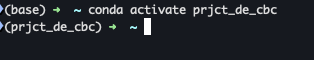


### 📜 Estilo de código Python
- **Formateo automático con Black** (alineado a PEP-8).
- **Imports ordenados** (estándar: librerías estándar → terceros → módulos locales).
- **Longitud de línea controlada** (70 / 89 / 100 según contexto y legibilidad).
- **Indentación consistente** (4 espacios).
- **Nombres de variables y funciones en `snake_case`.**
- **Clases en `CamelCase`.**
- **Constantes en `UPPER_CASE`.**
- Uso correcto de **espacios, paréntesis y method chaining** para legibilidad.

### 📄 Tipado y documentación
- **Type hints** para indicar claramente:
  - Qué entra a una función
  - Qué devuelve
  - *(No afectan la ejecución, pero mejoran mantenibilidad y tooling)*
- **Docstrings** para explicar:
  - Qué hace la función
  - Por qué existe
  - Reglas de negocio relevantes
  - *(No afectan la ejecución, pero documentan intención)*

### 🗝️ Constantes y valores por defecto
- **Constantes declaradas en MAYÚSCULAS**.
- **Valores hardcodeados centralizados** en `src/constants.py`.
- Eliminación de *Magic Strings* dispersos en el código.
- Uso explícito de valores dummy controlados (ej. `PD`, fechas por defecto).

### Manejo de fechas y tiempo
- **Timestamps manejados con buenas practivas, siempre en UTC (UTC+0)**.
- Formatos de fecha estandarizados y centralizados.


---

## 🏗 Arquitectura

La solución implementa una arquitectura desacoplada donde la lógica de negocio (ETL Spark) es independiente de la infraestructura subyacente.
Se implemento el framework brindado por AWS SDLF (Serverless Data Lake Framework)

* Arquitectura diseñada en la nube


> [!INFO]
> Prácticas altamente necesarias en proyectos corporativos de grandes volúmenes de datos batch/streaming

---

## 🧠 Principios de diseño

*Estas decisiones buscan maximizar mantenibilidad, claridad y escalabilidad sin sobre-ingeniería.*

- **ETL clásico bien definido**: Extract → Transform → Load
- **Configuración desacoplada** (YAML + OmegaConf)
- **Código testeable y legible**
- **No sobre‑ingeniería** (decisión consciente por ser prueba técnica)
- **Preparado para escalar** a un entorno corporativo real

---

## 📁 Estructura general del proyecto `cbc-data-pipeline`

El proyecto sigue una arquitectura modular inspirada en los principios de **Cookiecutter Data Science** y **Kedro**, adaptada para soportar despliegues híbridos (Local/Cloud).

```text
CBC/
├── conf/                       # Gestión de Configuración (OmegaConf)
│   ├── base/                   # Parámetros compartidos (schemas, constantes)
│   ├── cloud/                  # Config específica para AWS (S3 paths)
│   └── onpremise/              # Config para ejecución local (Local FS paths)
├── data/                       # Capa de datos
│   ├── input/                  # Datos crudos (Raw/Bronze)
│   └── processed/              # Datos transformados (Silver/Parquet)
├── infrastructure/             # Esta carpeta NO va dentro del ETL en un escenario prod
│   ├── docker/                 # Definición de Container (Multi-arch)
│   ├── sdlf-dataset/           # CloudFormation para Gobierno de Datos (Glue/LakeFormation)
│   └── terraform/              # Provisionamiento de Compute & Network (ECS, ECR, IAM, Redshift, Glue, S3)
├── notebook/                   # Zona de Experimentación (Sandboxing)
│   └── exploratory.ipynb       # Pruebas unitarias
├── src/                        # Código Fuente de la Aplicación
│   ├── analytics_helpers.py    # Lógica de negocio pura, se agrega archivo en blanco
│   ├── analytics_utils.py      # Utilidades de IO y Spark
│   ├── constants.py            # Constantes globales importantes en proyectos grandes
│   └── etl.py                  # Clase orquestadora del Pipeline
├── test/                       # Aseguramiento de Calidad (QA)
│   ├── conftest.py             # Separamos logica de folderes
│   └── test_cleaning.py        # Pruebas unitaras para transformaciones
├── main.py                     # Entrypoint de la aplicación
├── requirements.txt            # Dependencias Python (pinned versions)
└── README.md                   # Documentación técnica
```

---

## ⚙️ Configuración (YAML)

### `conf/base/parameters.yaml`
Contiene **reglas de negocio** y parámetros del pipeline:

- Países válidos `GT`
- Rango de fechas 
- Unidades de medida `CS: 20`
- Tipos de entrega  `["ZPRE", "ZVE1"]`
- Columnas relevantes

👉 Este archivo representa la **configuración funcional del negocio**.

---

### `conf/cloud/env.yaml`
Configuración específica para ejecución en la nube:

- Rutas S3 (input/output) `s3a://cbc-datalake-bronze/mobility/global_mobility_data_entrega_productos.csv`
- Formato de salida (Parquet) `s3a://cbc-datalake-silver/mobility/processed/x.parquet`
- Particiones Spark `shuffle_partitions : 4` 
- Parámetros de ejecución distribuida

---

### `conf/onpremise/env.yaml`
Configuración para ejecución local:

- Rutas locales `data/input/global_mobility_data_entrega_productos.csv`
- Número de particiones Spark `shuffle_partitions : 1` 
- Formato de salida

---

## 📊 Datos

### Entrada

`data/input/global_mobility_data_entrega_productos.csv`

Archivo CSV de entrada utilizado para la prueba técnica.


### Salida

`data/processed/`

- Cloud o Onpremise
- Datos transformados en formato **Parquet**
- Particionados por `fecha_particion`

---

## 🏗️ Infraestructura

### Docker

`docker/Dockerfile`

- Python **3.10**
- OpenJDK **11**
- PySpark
- Usuario **no root** (buenas prácticas de seguridad)

Permite ejecución reproducible del pipeline.

* Docker Imagen

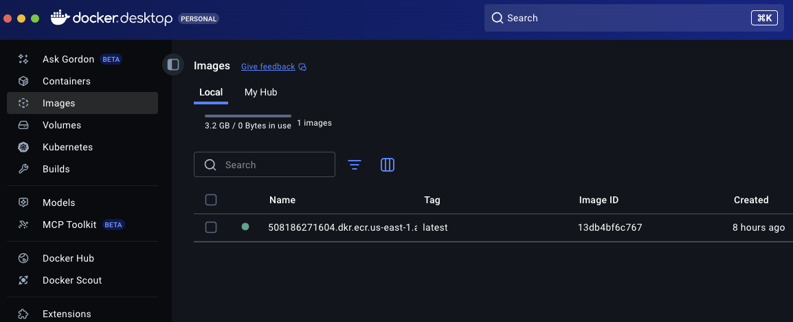

* Docker Contenedores

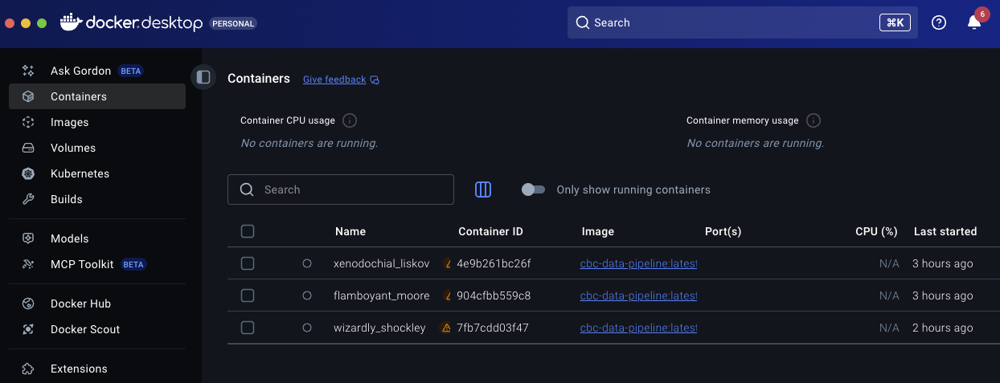

---

### 🏗️ Terraform

`terraform/main.tf`

Infraestructura base en AWS:

- Buckets S3 **Bronze / Silver**
- ECR
- ECS
- Redshift
- Glue Catalog
- Glue Crawler
- ECR Repository

👉 Incluido como referencia de **arquitectura cloud**, no como despliegue obligatorio para la prueba.

* Terraform init

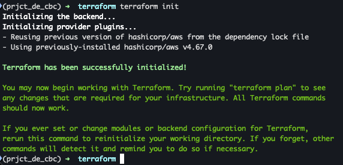

* Terraform plan

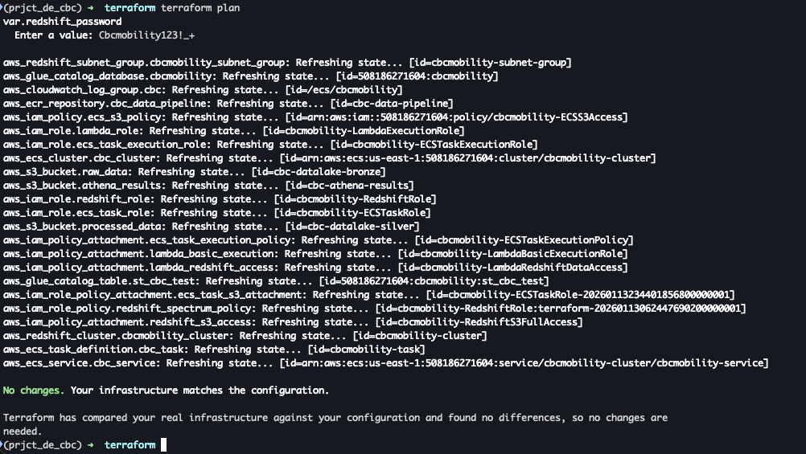

* Terraform apply

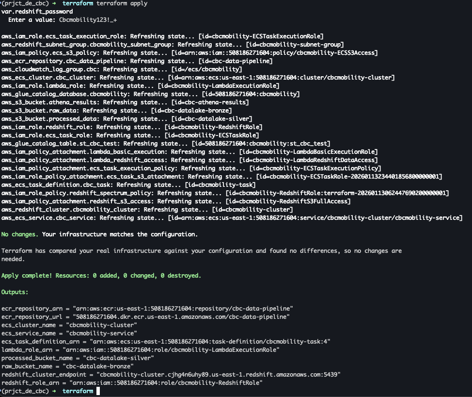

---

### 📖 CloudFormation (SDLF)

`infrastructure/sdlf-dataset/`

Implementación de gobierno de datos y esquemas (Schema-as-Code):

- **Glue Database** (`cbcmobility`)
- **Glue External Table** (`st_cbc_test`) con esquema tipado
- **Lake Formation** para gestión de permisos
- **Nested Stacks** para arquitectura modular

👉 Desacopla la definición de metadatos de la infraestructura de cómputo.
Sirve para definir y versionar las bases de datos y tablas Glue de forma declarativa usando CloudFormation/YAML.

---

### 📓 Notebook Exploratorio

`notebook/exploratory.ipynb`

Entorno interactivo para validación y debugging del pipeline:

- Importa la clase `ETLEngineer` directamente desde `src/` (evita duplicidad de código).
- Carga y combina configuraciones dinámicamente con **OmegaConf**.
- Ejecuta y visualiza paso a paso las fases **Extract, Transform y Load**.

👉 Permite inspeccionar los DataFrames y esquemas intermedios antes de la ejecución productiva.

* Notebook exploratorio
Se pueden visualizar los cambios que van sufriendo los datos conforme a los metodos/funciones.
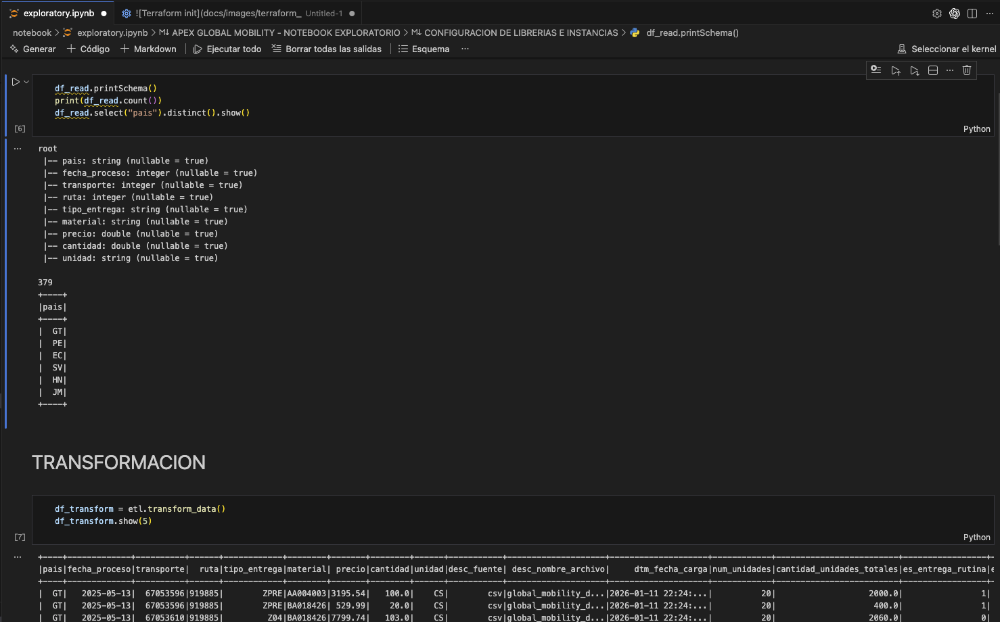

---

## 🧩 CODIGO FUENTE (`src/`)

- Separación conceptual **MECE**:
- No se sobre‑forzó la abstracción por tratarse de un pipeline compacto.
- Uso explícito de `None` en funciones donde aplica para claridad semántica.

### `__init__.py`

Archivo vacío para declarar `src` como paquete Python.

---

### `analytics_helpers.py`

Archivo **placeholder / documental**.

En un entorno corporativo contendría:

- Métricas
- Agregaciones
- KPIs

Se deja intencionalmente simple para la prueba técnica.

---

### `analytics_utils.py`

> [!TIP]
> Este módulo está diseñado para ser reutilizable entre distintos pipelines, evitando dependencias de columnas específicas o reglas hardcodeadas.
En un ambiente real, seria una dependencia `fuera del ETL` para uso del departamento.

Utilidades genéricas para PySpark.

Funcionalidad principal:

- `cleaning_df_spark(df)`
  - Limpieza basada en **tipos de datos**, no en columnas hardcodeadas
  - Manejo de nulos para:
    - Strings
    - Numéricos
    - Fechas

👉 Diseñado para ser **reutilizable y testeable**.

---

### `constants.py`

> [!IMPORTANT]
> No todas las variables fueron llevadas a constantes intencionalmente. En una prueba técnica pequeña se evita **sobre‑ingeniería** innecesaria, priorizando claridad y pragmatismo.

Centraliza constantes del proyecto:

- Valores por defecto
- Formatos de fecha

Se evita mover todo a constantes para **no sobre‑ingenierizar** la prueba.

---

### `etl.py`

Contiene la clase **`ETLEngineer`**, motor principal del pipeline.

#### 🚩 Métodos

- `read_data()`
  - Lectura desde CSV local o S3

- `transform_data()`
  - Filtrado por país y rango de fechas
  - Normalización de unidades
  - Clasificación de tipo de entrega
  - Limpieza genérica (`AnalyticsUtils`)
  - Eliminación de duplicados

- `write_data()`
  - Renombrado de columnas
  - Escritura Parquet particionada por `fecha_particion`

- `run()`
  - Orquesta el flujo completo
  - Manejo de excepciones y logging

---

### `main.py`

**Entrypoint del proyecto**.

Responsabilidades:

- Configuración de logging
- Carga de configuración en cascada:
  - Base → Entorno → CLI
- Instanciación de `ETLEngineer`
- Ejecución del pipeline

---

## 🧪 Tests

> [!NOTE]
> Los tests no buscan validar Spark como framework, sino garantizar que **nuestra lógica de negocio** se comporta correctamente ante distintos escenarios de datos.

- Pruebas automatizadas con **pytest**.
- Uso de `assert` para validar reglas críticas de negocio.
- Enfoque en testear lógica propia, no internals de Spark.

La carpeta `test/` contiene ** 1 tests unitario** enfocados en:

- Validar lógica de negocio
- Probar utilidades propias
- Evitar testear Spark como framework

👉 Se prioriza **calidad sobre cantidad** de tests.

* Prueba unitaria

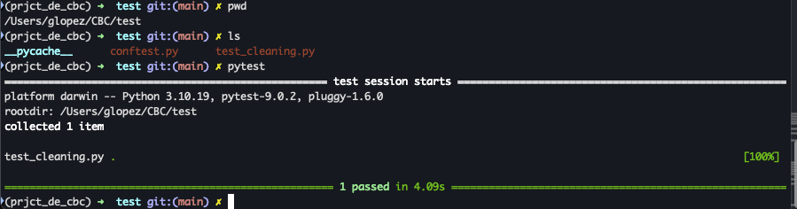

---

## 📦 Gestión de dependencias

El proyecto incluye un archivo `requirements.txt` que define todas las dependencias necesarias para su correcta ejecución.

Este archivo fue generado a partir del entorno virtual activo utilizando el siguiente comando:

```bash
pip list --format=freeze > requirements.txt
```

Incluye:

- PySpark 3.5
- OmegaConf
- Pandas
- NumPy
- Pytest
- Jupyter
- Librerías auxiliares para debugging

---

## ▶️ Ejecución

**Ejecución onpremise**
```bash
(prjct_de_cbc) GDLC-LAPTOP:~ glopez$ python main.py
```

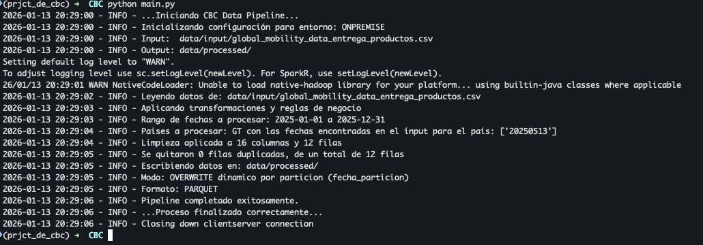


**Ejecución parametrizada**
```bash
(prjct_de_cbc) GDLC-LAPTOP:~ glopez$ python main.py \
pipeline.start_date=20250101 \
pipeline.end_date=20251231 \
pipeline.write_mode=overwrite \
pipeline.country='SV'
```

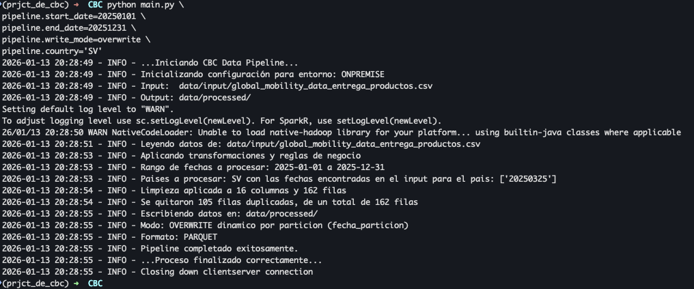

**Ejecución docker local**
```bash
(prjct_de_cbc) GDLC-LAPTOP:~ glopez$ eval $(aws configure export-credentials --profile gdlopezcastillo-cbc --format env)

(prjct_de_cbc) GDLC-LAPTOP:~ glopez$ docker run --platform linux/amd64 \
  -e AWS_ACCESS_KEY_ID=$AWS_ACCESS_KEY_ID \
  -e AWS_SECRET_ACCESS_KEY=$AWS_SECRET_ACCESS_KEY \
  -e AWS_SESSION_TOKEN=$AWS_SESSION_TOKEN \
  -e AWS_REGION=us-east-1 \
  -e ENV=CLOUD \
  508186271604.dkr.ecr.us-east-1.amazonaws.com/cbc-data-pipeline:latest
```

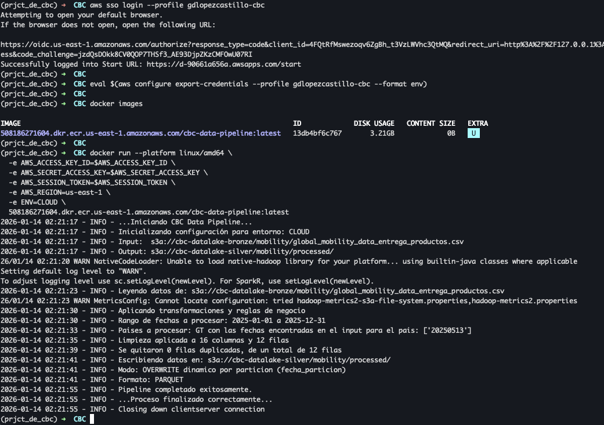

**Ejecución AWS**

* IAM

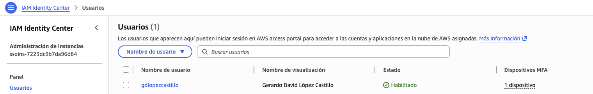

* ECR

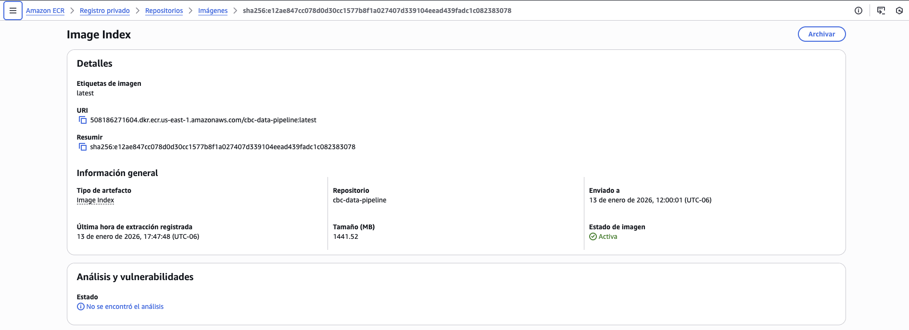

* ECS

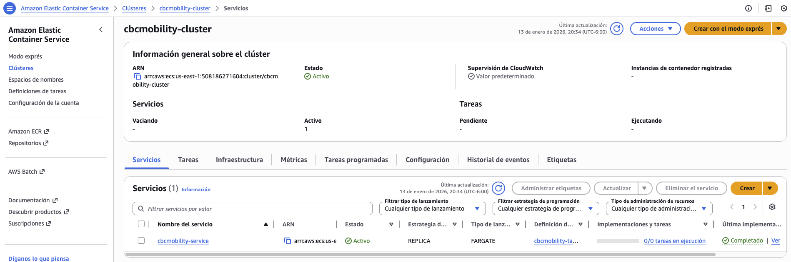

* CloudWatch

Log que vemos cuando se ejecuta el proceso local
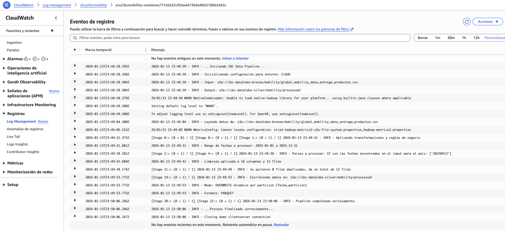

* S3

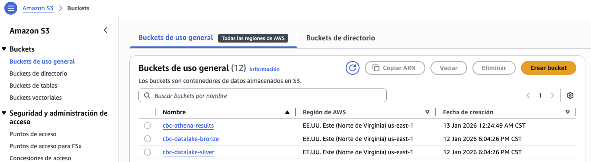

* Athena

Resultados de la tabla en silver anteponiendo st (staging)
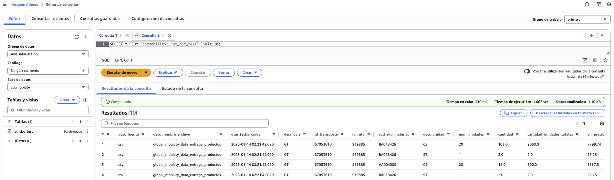

* Redshift

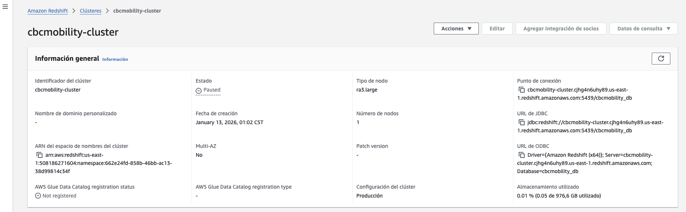

---

## 📚 Propuesta de columnas en tabla

* Estándar snake_case: Todos los atributos deben persistirse en minúsculas separadas por guiones bajos.
* Expresividad Semántica: Se priorizan nombres descriptivos sobre abreviaturas crípticas.
* Trazabilidad para todo proceso de ingesta de archivos (Excel, CSV, Flat Files), se inyectan obligatoriamente columnas de metadatos técnicos al inicio del esquema:
* El esquema de particionado se define en función del volumen de datos para evitar el problema de "Small Files" (exceso de archivos pequeños que degradan el rendimiento de lectura en S3). Para este caso pedian en prueba particionar por fecha_proceso -> fecha_particion


[!TIP] Para el dataset final (Silver/Gold), se adoptó una taxonomía basada en prefijos semánticos. Esto facilita el autoservicio (self-service BI) permitiendo a los analistas identificar la naturaleza del dato (dimensión, métrica, fecha o bandera) sin consultar el esquema técnico.

### 👽 Taxonomía de Prefijos (Naming Convention)

| Prefijo | Significado | Tipo de Dato Recomendado | Ejemplo |
| :--- | :--- | :--- | :--- |
| `id_` | Identificador único o llave foránea | `INT` / `BIGINT` | `id_ruta` |
| `cod_` | Código de negocio alfanumérico | `STRING` | `cod_sku_material` |
| `desc_` | Descripción textual o atributo dimensional | `STRING` | `desc_pais` |
| `dtm_` | Fecha y hora exacta (Date Time) | `TIMESTAMP` | `dtm_fecha_carga` |
| `num_` | Conteo de unidades discretas (enteros) | `INT` | `num_unidades` |
| `vlr_` | Valor monetario | `DOUBLE` / `DECIMAL` | `vlr_precio` |
| `es_` | Bandera booleana (Estado/Flag) | `INT (0/1)` | `es_entrega_rutina` |

### 🎉 Definición del Esquema (Schema Definition)
La tabla final st_cbc_test (Silver Layer) queda definida con la siguiente metadata técnica y de negocio:

| Columna Física | Tipo (Hive/Spark) | Descripción Funcional | Origen / Transformación |
| :--- | :--- | :--- | :--- |
| `desc_fuente` | `string` | Sistema origen de la información. | Inyectado por ETL (ej: 'SAP', 'CSV_Manual') |
| `desc_nombre_archivo` | `string` | Trazabilidad del archivo origen (Lineage). | `input_file_name()` |
| `dtm_fecha_carga` | `timestamp` | Momento exacto de ingestión al Data Lake. | `current_timestamp()` |
| `desc_pais` | `string` | País de operación (ISO Code). | Columna `pais` normalizada |
| `id_transporte` | `int` | Identificador único del vehículo. | Cast a `Integer` |
| `id_ruta` | `int` | Llave de la ruta de distribución. | Cast a `Integer` |
| `cod_sku_material` | `string` | Código SKU del producto (Material). | Limpieza de espacios (Trim) |
| `desc_unidad` | `string` | Unidad de medida estandarizada. | Mapeo `UNITS_CONVERSION` (ej: CS, ST) |
| `desc_tipo_entrega` | `string` | Categoría logística de la entrega. | Regla de negocio (`ZPRE`, `ZVE1`) |
| `num_unidades` | `int` | Cantidad física de unidades. | Campo directo |
| `cantidad` | `double` | Cantidad matemática base. | Campo directo |
| `cantidad_unidades_totales`| `double` | Total acumulado calculado. | `cantidad * factor_conversion` |
| `vlr_precio` | `double` | Precio unitario o valor total. | Campo directo |
| `es_entrega_rutina` | `int` | **1** si es entrega estándar, **0** si no. | Derivado de `tipo_entrega` |
| `es_entrega_bonificacion`| `int` | **1** si es bonificación, **0** si no. | Derivado de `tipo_entrega` |
| `fecha_particion` | `bigint` | Llave de partición física en S3. | Formato `YYYYMMDD` (ej: `20250101`) |

---

### 🚑 Control de versiones en GIT
- Uso de **Git con convención de ramas**:
  - `feature/*` (para nuevas funcionalidades) Desarrollo de nuevas capacidades
  - `bugfix/*` (para correcciones) Correcciones de errores no críticos.
  - `hotfix/*` (para arreglos urgentes) Parches urgentes a producción
  - `main`: Rama productiva estable. Protegida contra escrituras directas
  - `develop`: Rama de integración
  - `.gitignore` Por ser un entorno/preuba, no se agrega nada en gitignore, pero es nesario saber que se tiene que excluir:
    - Archivos de variables de entorno (.env, .env.local)
    - Llaves de acceso y credenciales (*.pem, credentials.json)
    - Configuraciones locales de IDE (.vscode/, .idea/).

---

<div align="center">
  <h3><b>Gerardo López</b></h3>
  <p>Senior Data Engineer | Data Architect | Cloud Engineer</p>

<div align="center">
  <a href="https://linktr.ee/gdlopezcastillo" target="_blank">
    
  </a>
  <a href="https://www.linkedin.com/in/gdlopezcastillo/" target="_blank">
    
  </a>
  <a href="mailto:gdlopezcastillo@gmail.com">
    
  </a>
  <a href="https://github.com/gerardodavidlopezcastillo" target="_blank">
    
  </a>
</div>